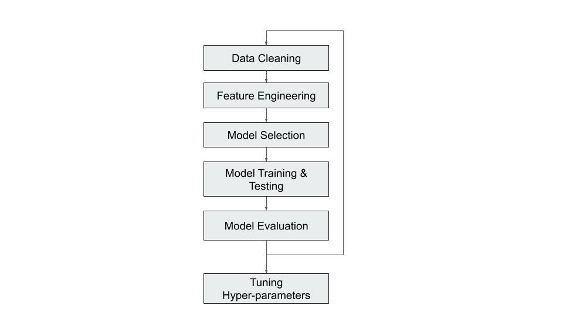

# Machine_learning_Revenue_Prediction

### Description  

The project is based on Machine Learning. The objective is to make a model to predict the company's revenue for next year based on historical data. We have the dataset from 2015-2020. 

### Installation
The libraries on the `requirements.txt` should be installed in order to run the program.
Use `pip install requirements.txt` for installation.

### Usage  
Follow these steps to run the program:

1. Download the main branch of the repository. Along with the `README.md`, it consists of two files `data_cleaning.ipynb` and `ml_model.py`
2. Install the libraries in `requirements.txt`.
3. Save the provided data in the json format in the repository folder.
4. Run the `data_cleaning.ipynb` to have a clean dataset for the model.
5. Run the `ml_model.py` which will train and test the dataset and provide the scores for model evaluation.

### Program flow  

### Output
We tested three different models namely Linear Regression, Random Forest and XGBoost. The best results were with XGBoost. It is also one of the strongest Machine Learning Models available.

The score of our model is the following:  

Coefficient of determination (R^2): 0.729 (0.239)  

Therefore, our model is 73% accurate. 

### Future works
1. Improve the code to predict the current revenue as there are many Null values in the current revenue.
2. Prediction based on company category and detecting and handling the outliers.
3. Minimize the zero values in the staff cost based on the staff count.
4. Fine tuning the hyperparameters.
